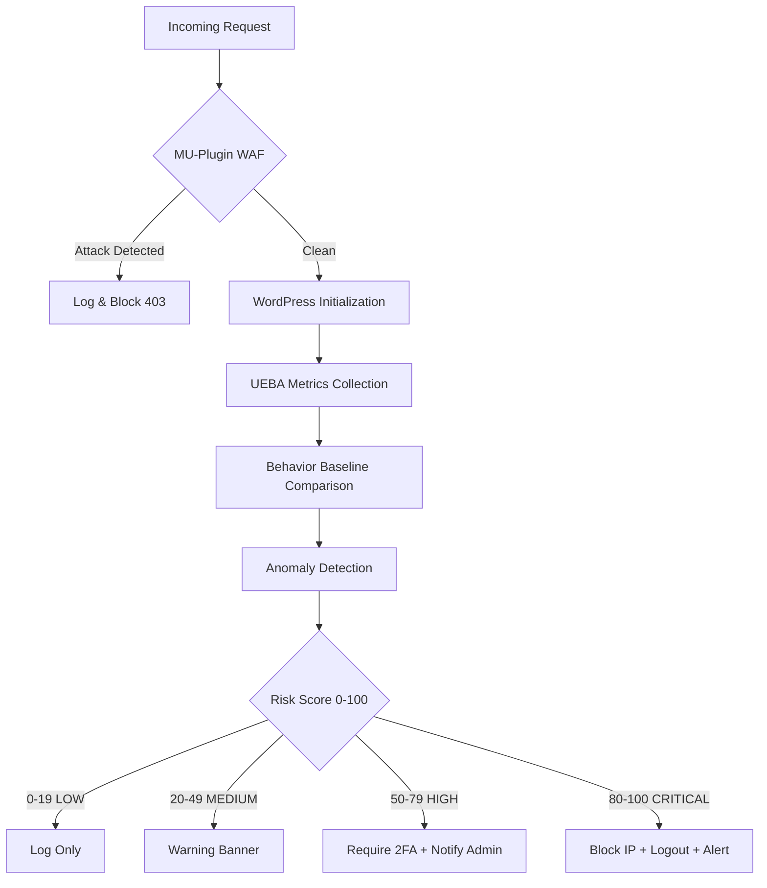

# SpectrusGuard Enterprise: AI-Powered Security Suite

<div align="center">


[](https://github.com/carlosindriago/SpectrusGuard/releases)
[](https://wordpress.org/)
[](https://php.net/)
[](LICENSE)
[](.github/workflows/)

**Next-generation WordPress security combining military-grade WAF protection with AI-powered User & Entity Behavior Analytics (UEBA).**

[Getting Started](#-installation) · [Documentation](#-documentation) · [Roadmap](#-roadmap) · [Contributing](#-contributing)

</div>

---

## 🚀 What Makes SpectrusGuard Different?

Traditional security plugins rely on static rules that attackers can bypass. SpectrusGuard uses **User and Entity Behavior Analytics (UEBA)** to detect threats that rules miss:

| Traditional Security | SpectrusGuard Enterprise |
| :--- | :--- |
| ❌ Static regex rules | ✅ Adaptive ML-driven detection |
| ❌ Known bot signatures | ✅ Behavior-based bot detection |
| ❌ Geo-blocking only | ✅ Full behavioral profiling |
| ❌ Post-attack logging | ✅ Predictive threat detection |
| ❌ Manual threat response | ✅ Automated incident response |

### Real-World Protection Examples

<details>
<summary><strong>Scenario 1: Account Takeover Prevention</strong></summary>

- **Traditional:** Detects brute force, but not credential stuffing.
- **SpectrusGuard:** Detects unusual login patterns (time, location, device) → Blocks **before** damage.
</details>

<details>
<summary><strong>Scenario 2: Stealth Bot Attack</strong></summary>

- **Traditional:** Blocks known bot user-agents (easy to spoof).
- **SpectrusGuard:** Detects request velocity anomalies → Zero-day bot protection.
</details>

<details>
<summary><strong>Scenario 3: Insider Threat</strong></summary>

- **Traditional:** No detection for compromised legitimate users.
- **SpectrusGuard:** Detects behavioral deviations → Alerts on privilege escalation.
</details>

---

## 🛡️ Core Features

### 1. Zero-Latency WAF (Web Application Firewall)

| Feature | Description |
|---------|-------------|
| **Drop-In MU-Plugin** | Executes *before* WordPress loads for maximum protection |
| **Deep Packet Inspection** | Blocks SQL Injection, XSS, RCE, LFI/RFI, Path Traversal |
| **Evasion Protection** | Multi-pass URL decoding, HTML entity decoding, Unicode escapes |
| **Rate Limiting** | Configurable per-IP request throttling |
| **Ruleset** | 300+ regex patterns maintained by security researchers |

### 2. Advanced Threat Analytics (UEBA)

**User Behavior Profiling:**
- Login frequency patterns (daily, weekly, seasonal)
- Geographic location tracking (country, city)
- Device/browser fingerprinting
- Time-of-day analysis
- Request velocity monitoring

**Anomaly Detection Algorithms:**
- **Z-Score Analysis:** Detects statistical outliers (99.7% confidence)
- **IQR Method:** Robust outlier detection for skewed data
- **Sequential Pattern Analysis:** Identifies unusual navigation sequences
- **Moving Average Deviation:** Detects sudden behavioral changes

**Risk Scoring System (0-100):**

| Score | Risk Level | Automated Response |
|:---:|:---|:---|
| 0-19 | 🟢 LOW | Log only |
| 20-49 | 🟡 MEDIUM | Warning banner to user |
| 50-79 | 🟠 HIGH | Require 2FA + Notify admin |
| 80-100 | 🔴 CRITICAL | Block IP + Logout + Urgent email |

### 3. Geo-Defense Strategy

- **Country Blocking:** Restrict access using local MaxMind GeoLite2 database
- **Tor Node Detection:** Automatically identify and block Tor exit nodes
- **VPN/Datacenter Detection:** Identify and flag suspicious IP ranges
- **Intelligent Fail-Open:** If geo database unavailable, allows access (no false positives)

### 4. Stealth & Hardening

- **Ghost Cloak:** Completely hides `/wp-content`, `/wp-includes` via rewrite rules
- **Login Page Protection:** Move `/wp-login.php` to custom secret slug
- **Zero-Trust 2FA:** Enforce TOTP (Google Authenticator) for administrators
- **Brute Force Protection:** Intelligent lockout with exponential backoff
- **Header Hardening:** Removes `X-Powered-By`, WordPress version generators
- **REST API Hardening:** Custom API prefix, endpoint whitelisting, authentication enforcement

### 5. Self-Protection & Integrity System

| Feature | Description |
|---------|-------------|
| **File Integrity Verification** | SHA-256 hashes of critical files verified against signed manifest |
| **GitHub Actions Signing** | `integrity.json` automatically generated on each release |
| **Tamper Detection** | Alerts when core plugin files are modified |
| **Critical File Monitoring** | 14+ files marked as high-risk monitored in real-time |
| **Auto-Update Verification** | Validates file hashes after plugin updates |

### 6. Internationalization (i18n)

- **Multi-Language Support:** Automatically adapts to WordPress language settings
- **Included Translations:** Spanish (es_ES) fully translated
- **Translation-Ready:** POT template file for community translations
- **Text Domain:** `spectrus-guard` with proper escaping functions

### 7. Immersive Admin Interface

- **SPA-Like Experience:** Custom "Immersive Mode" UI overriding standard WordPress styling
- **Dark Mode:** High-contrast Slate/Indigo theme optimized for SOC environments
- **Real-Time Dashboard:** Threat analytics with Chart.js visualizations
- **Activity Logs:** Traffic inspection with severity tagging
- **Quick Actions:** Emergency hardening with one-click deployment
- **Help & Documentation:** 10-section built-in documentation accessible from admin

---

## 📦 Installation

### Prerequisites

| Requirement | Minimum Version |
|-------------|-----------------|
| WordPress | 6.4+ |
| PHP | 8.1+ |
| MySQL / MariaDB | 5.7+ / 10.2+ |
| PHP Extensions | `mysqli`, `curl`, `gd`, `mbstring`, `json` |

### Quick Install

```bash
# 1. Upload via WordPress Admin
Plugins → Add New → Upload Plugin → spectrus-guard.zip

# 2. Activate
Find SpectrusGuard → Click Activate

# 3. Verify MU-Plugin (auto-installed)
ls wp-content/mu-plugins/spectrus-waf.php

# 4. Configure
Follow the initial setup wizard
```

### Manual Installation (Developers)

```bash
cd /wp-content/plugins/
git clone https://github.com/carlosindriago/SpectrusGuard.git spectrus-guard

# Set proper permissions
cd spectrus-guard
find . -type d -exec chmod 755 {} \;
find . -type f -exec chmod 644 {} \;

# Ensure log directory is writable
mkdir -p ../../spectrus-guard-logs
chmod 755 ../../spectrus-guard-logs

# (Optional) Install dev dependencies
composer install
```

### Rescue Mode (If Locked Out)

If you're locked out due to misconfiguration:

```
https://yoursite.com/?ghost_rescue=YOUR_RESCUE_KEY
```

The rescue key is available in your SpectrusGuard dashboard under **Settings → Emergency**.

---

## ⚙️ Configuration

### Initial Setup Wizard

| Security Level | Description |
|----------------|-------------|
| **Balanced** | Recommended for most sites |
| **High Strict** | Maximum security, may impact usability |
| **Custom** | Manually configure each setting |

### UEBA Learning Period

| Duration | Accuracy | Recommendation |
|----------|----------|----------------|
| 7 days | Minimum baseline | Small sites |
| 30 days | Good accuracy | Most sites |
| 90 days | Best accuracy | Enterprise |

### Key Settings

<details>
<summary><strong>WAF Settings</strong></summary>

```php
// wp-config.php or via admin
define('SG_WAF_ENABLED', true);
define('SG_WAF_LOG_LEVEL', 'WARNING'); // INFO, WARNING, ERROR
```
</details>

<details>
<summary><strong>Geo-Blocking</strong></summary>

- **Blocked Countries:** Select countries to block
- **Tor Blocking:** Enable/disable Tor detection
- **Action:** `403`, `CAPTCHA`, or `Redirect`
</details>

<details>
<summary><strong>Login Security</strong></summary>

- **Login Slug:** Custom path (e.g., `/my-secret-login`)
- **2FA Enforced:** Require TOTP for specific roles
- **Lockout Attempts:** Max failed login attempts (default: 5)
- **Lockout Duration:** Temporary block duration (default: 1 hour)
</details>

<details>
<summary><strong>UEBA Settings</strong></summary>

```php
// Risk thresholds (default)
define('SG_RISK_THRESHOLD_HIGH', 50);
define('SG_RISK_THRESHOLD_CRITICAL', 80);
define('SG_UEBA_LEARNING_DAYS', 7);
```
</details>

<details>
<summary><strong>Trusted Proxies (Cloudflare, AWS ALB, etc.)</strong></summary>

Configure trusted proxy IPs to prevent IP spoofing:

```php
// In WordPress Admin → SpectrusGuard → Settings → Advanced
// Or programmatically:
$settings = get_option('spectrus_shield_settings', []);
$settings['trusted_proxies'] = [
    '103.21.244.0/22',  // Cloudflare
    '103.22.200.0/22',
    '173.245.48.0/20',
    // ... add your load balancer IPs
];
update_option('spectrus_shield_settings', $settings);
```
</details>

---

## 🏗️ Architecture

### Plugin Structure

```
spectrus-guard/
├── spectrus-guard.php            # Main bootstrap file
├── integrity.json                # SHA-256 file signatures (auto-generated)
├── composer.json                 # Dev dependencies & autoloading
├── mu-loader/
│   └── spectrus-waf.php          # Drop-in WAF (executes before WP)
├── assets/
│   ├── css/admin.css             # Immersive Mode styles
│   └── js/
│       ├── admin.js              # Admin interactions
│       ├── threat-chart.js       # Chart.js threat visualization
│       └── admin/
│           ├── scanner.js        # Malware scanner UI
│           ├── quarantine.js     # Quarantine management
│           └── whitelist.js      # Whitelist management
├── languages/                    # Internationalization
│   ├── spectrus-guard.pot        # Translation template
│   ├── spectrus-guard-es_ES.po   # Spanish translation
│   └── spectrus-guard-es_ES.mo   # Compiled Spanish
├── scripts/
│   └── generate-integrity.php    # Integrity manifest generator
├── templates/
│   └── views/                    # Separated HTML templates (MVC)
│       ├── block-page.php        # WAF block page
│       └── rescue-ui.php         # Ghost Rescue UI
├── includes/
│   ├── class-sg-loader.php       # Singleton orchestrator
│   ├── class-sg-logger.php       # PSR-3 compliant logging
│   ├── traits/
│   │   └── IpDetectionTrait.php  # Unified IP detection
│   ├── admin/                    
│   │   ├── class-sg-admin.php    # Admin controller
│   │   ├── class-sg-ajax.php     # AJAX handlers
│   │   ├── class-sg-log-parser.php # Log parser with generators
│   │   └── pages/
│   │       └── class-sg-page-help.php # Help & Documentation
│   ├── security/
│   │   └── class-sg-integrity.php # Self-protection & tamper detection
│   ├── geo/
│   │   └── class-sg-cloudflare-ips.php # CloudFlare IP auto-updater
│   ├── hardening/                # Security hardening modules
│   │   └── class-sg-api-guard.php # REST API hardening
│   ├── scanner/                  # Malware scanner & signatures
│   ├── waf/                      # Web Application Firewall
│   ├── whitelist/                # File whitelist management
│   └── ueba/                     # AI-Powered Behavior Analytics
│       ├── class-sg-ueba-engine.php
│       ├── class-sg-metrics-collector.php
│       ├── class-sg-behavior-profile.php
│       ├── class-sg-anomaly-detector.php
│       ├── class-sg-risk-scorer.php
│       └── class-sg-response-engine.php
├── .github/
│   └── workflows/
│       └── integrity.yml         # Auto-sign releases
├── UEBA-README.md                # UEBA documentation
├── CHANGELOG.md                  # Version history
└── README.md                     # This file
```

### Data Flow



---

## 🔐 Security Standards

### Compliance

| Standard | Coverage |
|----------|----------|
| **OWASP Top 10** | ✅ All top 10 web application risks |
| **CWE/SANS Top 25** | ✅ Critical software weaknesses |
| **GDPR** | ✅ Data minimization, privacy by design |
| **SOC 2** | ✅ Logging, auditing, access control |

### Implementation Practices

| Area | Implementation |
|------|---------------|
| **Input Validation** | Strict typing, `sanitize_*()` functions, length limits |
| **Output Encoding** | `esc_html()`, `esc_attr()`, `esc_url()`, context-aware escaping |
| **Database Security** | `$wpdb->prepare()`, parameterized queries, proper indexing |
| **Cryptography** | `random_int()`, HMAC-SHA1 TOTP, SHA-256 fingerprints |
| **Logging** | Append-only audit trails, 30-day retention, severity levels |

---

## 📊 Threat Analytics Dashboard

Access at **SpectrusGuard → Threat Analytics**

| Component | Description |
|-----------|-------------|
| **Risk Score Overview** | Distribution of user risk levels with color-coded cards |
| **Activity Timeline** | Last 24h security events with Chart.js visualization |
| **Top Risky Users** | User details, risk score, anomaly count, last activity |
| **Top Risky IPs** | IP address, failed logins, one-click block action |
| **Anomalies Feed** | Type, severity, description, affected user, timestamp |

### REST API Endpoints

```bash
# Get user risk score
GET /wp-json/spectrus-guard/v1/ueba/risk-score/{user_id}

# Get user baseline
GET /wp-json/spectrus-guard/v1/ueba/baseline/{user_id}

# Get user anomalies
GET /wp-json/spectrus-guard/v1/ueba/anomalies/{user_id}

# Get attack statistics
GET /wp-json/spectrus-guard/v1/stats
```

---

## 🧪 Development & Testing

### Dev Dependencies (Composer)

```bash
composer install

# Lint (WordPress Coding Standards)
composer run lint

# Fix coding standard issues
composer run lint:fix

# Static Analysis (PHPStan)
composer run analyze
```

### CI/CD Pipeline

Automated workflows on every push:
- ✅ Linting (PHP CS Fixer / WPCS)
- ✅ Static analysis (PHPStan Level 8)
- ✅ Unit tests (PHPUnit)
- ✅ Integration tests
- ✅ Security audit

---

## 🚀 Performance

| Metric | Performance | Notes |
|--------|-------------|-------|
| WAF Overhead | < 2ms | Per request |
| UEBA Collection | < 5ms | Per event |
| Baseline Calculation | < 50ms | Cached for 1 hour |
| Dashboard Load | < 200ms | With Chart.js |
| Database Queries | < 5 | Per request |

### Optimization Strategies

- **Aggressive Caching:** Baselines cached in `wp_cache`
- **Lazy Loading:** UEBA components loaded on-demand
- **Database Indexing:** Composite indexes for common queries
- **Async Processing:** Logging via `wp-cron`
- **Query Limits:** Pagination to prevent large result sets

---

## 📈 Roadmap

### v3.1 (Q1 2026)
- [ ] Machine learning clustering (K-Means)
- [ ] Predictive threat scoring
- [ ] Behavioral biometrics (typing patterns)
- [ ] Real-time WebSocket alerts

### v3.2 (Q2 2026)
- [ ] SIEM integration (Splunk, ELK Stack)
- [ ] Threat intelligence feeds (AbuseIPDB, VirusTotal)
- [ ] Automated incident response (SOAR)
- [ ] Custom anomaly rules engine

### v4.0 (Q3 2026)
- [ ] Multi-tenant support
- [ ] SaaS offering (cloud-managed)
- [ ] Mobile app (admin monitoring)
- [ ] API-first architecture

---

## 🤝 Contributing

We welcome contributions from the security community!

### Getting Started

```bash
# 1. Fork & Clone
git clone https://github.com/YOUR_USERNAME/SpectrusGuard.git
cd SpectrusGuard

# 2. Install dependencies
composer install

# 3. Create feature branch
git checkout -b feature/your-feature-name

# 4. Make changes following our standards
# 5. Submit Pull Request
```

### Contribution Guidelines

- Follow **PSR-12** coding standards
- Use **Conventional Commits** (`feat`, `fix`, `refactor`, etc.)
- Write tests for new features (90%+ coverage)
- Ensure **PHPStan Level 8** compliance
- Update documentation

---

## 📞 Support & Community

SpectrusGuard is a community-driven open source project. We encourage developers to contribute and help improve the ecosystem.

- **Bug Reports & Feature Requests:** Please use the [GitHub Issues](https://github.com/carlosindriago/SpectrusGuard/issues) tracker.
- **Documentation:** Visit the `docs/` folder in this repository.
- **Security Vulnerabilities:** If you discover a sensitive security issue, please **do not open a public issue**. Instead, use the "Report a vulnerability" tab in the GitHub repository or contact the maintainer directly via [GitHub profile](https://github.com/carlosindriago).

> **Note:** As an open-source project, support is provided by the community and is not guaranteed.

## 📚 Documentation

| Resource | Link |
|----------|------|
| **UEBA Documentation** | [UEBA-README.md](UEBA-README.md) |
| **Changelog** | [CHANGELOG.md](CHANGELOG.md) |
| **API Documentation** | [docs/api/](docs/api/) |
| **Architecture Decisions** | [docs/adr/](docs/adr/) |

---

## 📄 License

SpectrusGuard is licensed under the **GPL v2 or later**.

```
SpectrusGuard Enterprise
Copyright (C) 2024-2026 Carlos Indriago

This program is free software; you can redistribute it and/or modify
it under the terms of the GNU General Public License as published by
the Free Software Foundation; either version 2 of the License, or
(at your option) any later version.
```

---

## ⚠️ Disclaimer & Liability

**SpectrusGuard is an Open Source project provided "as is", without warranty of any kind, express or implied.**

By installing and using this software, you acknowledge and agree that:

1. **Use at Your Own Risk:** The developers and contributors of SpectrusGuard are not responsible for any damage to your website, data loss, server downtime, or financial loss resulting from the use or misconfiguration of this plugin.
2. **No Guarantee of Security:** While SpectrusGuard implements military-grade security measures, no software can guarantee 100% protection against all cyber threats. You remain responsible for maintaining your server's overall security, backups, and updates.
3. **Responsible Use:** This tool is designed for defensive security purposes only. The authors condemn any malicious use of the source code.
4. **Testing Required:** This is a powerful system that alters standard WordPress behavior. **Always test in a staging environment** before deploying to a live production site.

> **If you do not agree to these terms, please do not use this software.**

---

## 🙏 Acknowledgments

- **WordPress Core Team** — For an amazing platform
- **MaxMind** — For GeoLite2 database
- **Chart.js** — For beautiful visualizations
- **Security Community** — For research and advisories

---

<div align="center">

**SpectrusGuard Enterprise v3.0.7**

*Protecting WordPress with AI-powered security since 2024*

**Developed by [Carlos Indriago](https://github.com/carlosindriago)**

[⬆ Back to Top](#spectrusguard-enterprise-ai-powered-security-suite)

</div>
